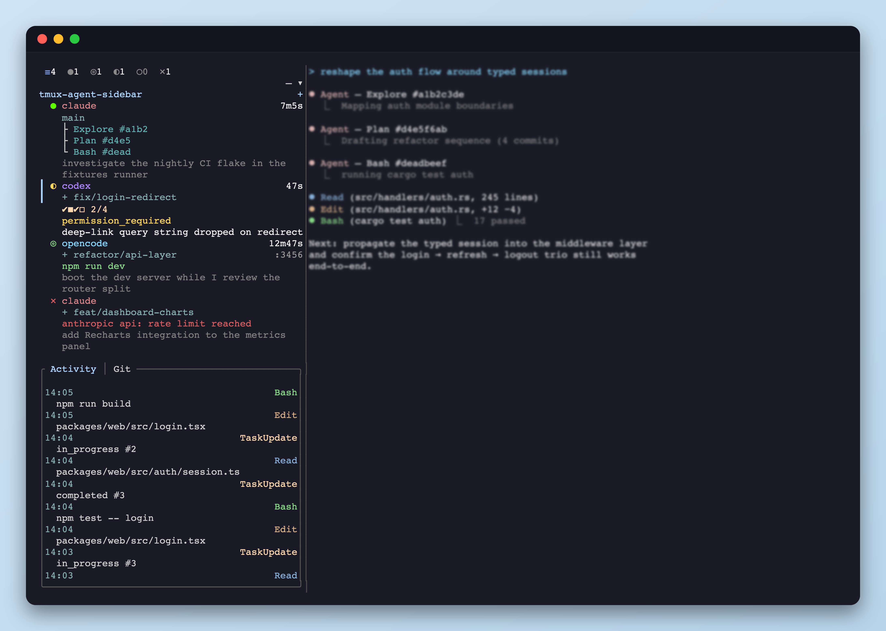

<h1 align="center">tmux-agent-sidebar</h1>

<p align="center">One rmux sidebar that tracks every Claude Code, Codex, and OpenCode pane across every session and window. See status, background shells, prompts, activity, wait reasons, task progress, and subagents without switching windows.</p>

<p align="center"></p>

<p align="center">
  <a href="https://hiroppy.github.io/tmux-agent-sidebar/">Documentation</a> ·
  <a href="https://hiroppy.github.io/tmux-agent-sidebar/getting-started/installation/">Getting Started</a> ·
  <a href="https://hiroppy.github.io/tmux-agent-sidebar/features/agent-pane/">Features</a>
</p>

## Features

- **Every pane, one view** 
  — tracks Claude Code, Codex, and OpenCode panes across all rmux sessions and windows
- **Live metadata** 
  — prompts, tool calls, response previews, background shell state, wait reasons, task progress, and subagent trees refresh as the agents work
- **Rmux API integration**
  — all sidebar multiplexer operations go through rmux Rust APIs, including pane input via `Rmux::broadcast`

OpenCode uses a small local plugin bridge instead of per-event hook config. The plugin lives at `.opencode/plugins/tmux-agent-sidebar.js` and can be symlinked as a single file into `~/.config/opencode/plugins/` so it coexists with any existing plugins.

## Requirements

- rmux 0.5+

## Quick Start

### 1. Install the plugin

Clone the plugin into rmux's plugin directory:

```sh
mkdir -p ~/.rmux/plugins
git clone https://github.com/hiroppy/tmux-agent-sidebar ~/.rmux/plugins/tmux-agent-sidebar
~/.rmux/plugins/tmux-agent-sidebar/install-wizard.sh auto
```

The install wizard downloads a pre-built binary or builds from source, then registers rmux key bindings and hooks through the Rust rmux API.

### 2. Wire up the agent hooks

- **Claude Code** — register the plugin inside Claude Code:

  ```sh
  /plugin marketplace add ~/.rmux/plugins/tmux-agent-sidebar
  /plugin install tmux-agent-sidebar@hiroppy
  ```

- **Codex** — open a Codex pane, press `prefix + e`, click the yellow `ⓘ` badge, copy the setup snippet, paste it into the Codex pane.
- **OpenCode** — symlink just the plugin file so your existing `~/.config/opencode/plugins/` contents stay untouched:

  ```sh
  mkdir -p ~/.config/opencode/plugins
  ln -sf ~/.rmux/plugins/tmux-agent-sidebar/.opencode/plugins/tmux-agent-sidebar.js \
    ~/.config/opencode/plugins/tmux-agent-sidebar.js
  ```

Full walkthroughs: [Claude Code setup](https://hiroppy.github.io/tmux-agent-sidebar/getting-started/claude-code/) · [Codex setup](https://hiroppy.github.io/tmux-agent-sidebar/getting-started/codex/) · [OpenCode setup](https://hiroppy.github.io/tmux-agent-sidebar/getting-started/opencode/)

### 3. Toggle the sidebar

`prefix + e` toggles the sidebar in the current window, `prefix + E` toggles it everywhere.

## Documentation

The [documentation site](https://hiroppy.github.io/tmux-agent-sidebar/) covers every feature and option:

- [Agent pane breakdown](https://hiroppy.github.io/tmux-agent-sidebar/features/agent-pane/)
- [Activity log](https://hiroppy.github.io/tmux-agent-sidebar/features/activity-log/)
- [Agent support matrix](https://hiroppy.github.io/tmux-agent-sidebar/agents/)
- [Keybindings](https://hiroppy.github.io/tmux-agent-sidebar/reference/keybindings/) · [rmux options](https://hiroppy.github.io/tmux-agent-sidebar/reference/tmux-options/) · [Scripting](https://hiroppy.github.io/tmux-agent-sidebar/reference/scripting/)

## Development

Symlink the plugin directory to your working copy so builds are picked up without copying:

```sh
rm -rf ~/.rmux/plugins/tmux-agent-sidebar
ln -s <path-to-this-repo> ~/.rmux/plugins/tmux-agent-sidebar
cargo build --release
~/.rmux/plugins/tmux-agent-sidebar/tmux-agent-sidebar.tmux
```

Toggle the sidebar off → on to pick up the new binary.

### Picking up local builds for the Claude Code plugin

If you also installed this as a Claude Code plugin (`/plugin`), its install path
holds a copy of the released binary that hooks resolve before falling back to
`target/release/`. To make local builds flow through Claude Code hooks too,
replace that copy with a symlink to your working copy:

```sh
# Replace the cached plugin install with a symlink to your repo
PLUGIN_CACHE=~/.claude/plugins/cache/<owner>/tmux-agent-sidebar/<version>
rm -rf "$PLUGIN_CACHE"
ln -s <path-to-this-repo> "$PLUGIN_CACHE"
```

Also remove the stale release binary at `bin/tmux-agent-sidebar` in your repo
if present — both the rmux launcher and `hook.sh` prefer `bin/` over
`target/release/`, so a leftover binary there will mask `cargo build --release`
output:

```sh
rm -f bin/tmux-agent-sidebar
```

Note: Claude Code's plugin updater may overwrite the symlink on a future
update; re-run the symlink step if that happens.

## License

[MIT](./LICENSE)
